# 正規分布(Normal Distribution)

* 平均を中心に左右対称に分布する釣り鐘型の確率分布
* 連続型の確率分布の一つ
* もっとも自然な確率分布であるため頻繁に利用される

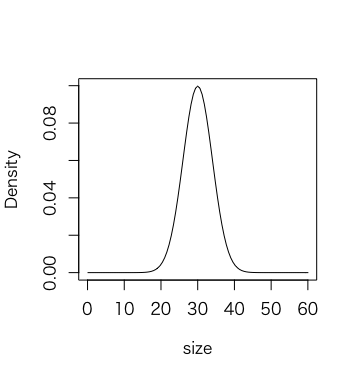

---

## 正規分布の表記

* 正規分布は `N` で表現する
* 正規分布は平均と分散（標準偏差）の2つのパラメータで確率分布が決まる
* 正規分布の表記（Nのパラメータ）には標準偏差ではなく分散を記述することが一般的である

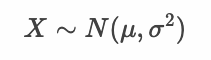

> 「確率変数 `X` は 平均 μ、分散 σ^2 の正規分布にしたがう」と読みます。

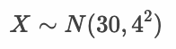

> 「確率変数 `X` は 平均 30、分散 4^2 の正規分布にしたがう」と読みます。

---

## 確率密度関数

* 正規分布の縦軸は確率（Probability）ではなく確率密度（Probability Density）である点に注意する
* 正規分布の確率密度は以下の確率密度関数（PDF：Probability Density Function）から算出できる

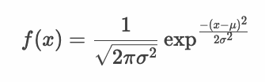

> π と exp は定数です。また μ と σ^2 は正規分布のパラメータとして決まります。

* 連続型確率変数の範囲を指定して確率密度関数の積分を求めることで確率を算出できる

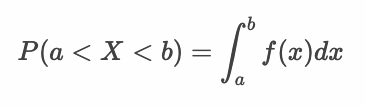

> 密度は体積を掛けることで質量を算出できます。同様に人口密度に面積を掛けると人口を算出できます。確率密度も連続型確率変数のとりうる範囲を指定することで確率を算出できます。Rを使えば簡単に確率を算出できます。

---

## 正規分布のパラメータ

* 正規分布のパラメータである平均を変化させるとグラフの中心が移動する
* 黒色のグラフ 平均：0 分散：1 の正規分布
* 赤色のグラフ 平均：2 分散：1 の正規分布

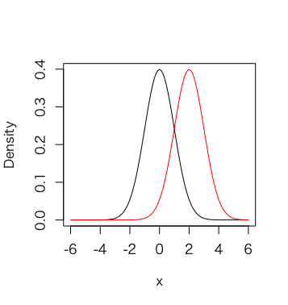

> 黒色のグラフは N(0, 1) の正規分布です。赤色のグラフは N(2, 1) の正規分布です。

* 正規分布のパラメータである分散（標準偏差）を変化させるとグラフのばらつきが変化する
* 黒色のグラフ 平均：0 分散：1 の正規分布
* 青色のグラフ 平均：0 分散：2 の正規分布

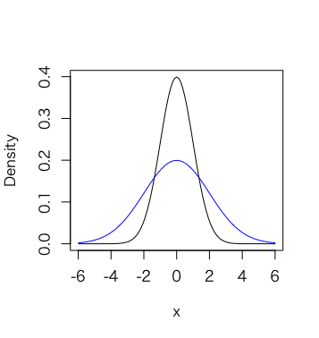

> 黒色のグラフは N(0, 1) の正規分布です。青色のグラフは N(0, 2) の正規分布です。

---

## 標準正規分布

* 平均：0、分散（標準偏差）：1 の正規分布

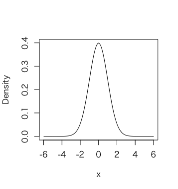

* データの標準化（z-score）を行うことで標準正規分布に変換できる

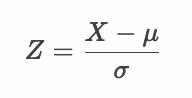

* 標準正規分布の確率密度関数

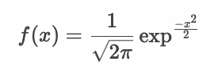

* 標準正規分布の確率は標準正規分布表から簡単に算出できる

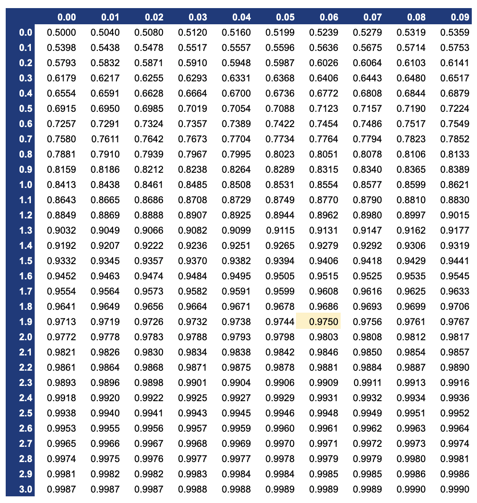

---

## エクササイズ

1. 正規分布の確率密度関数を定義して、正規分布（平均：30、分散：16） の確率密度グラフを表示してください。

2. 以下のデータセット（height:身長データ）を使ってヒストグラムを表示してください。また平均と標準偏差を表示してください。

https://gist.githubusercontent.com/murayama333/11272bc1b3f04beccc6fd2fcafcd513c/raw/c8acfb2123f972f07ae9c9951b01b303de4b6926/my_data.csv

3. 上記のデータセット（height:身長データ）を使って標準化してヒストグラムを表示してください。また平均と標準偏差を表示してください。
