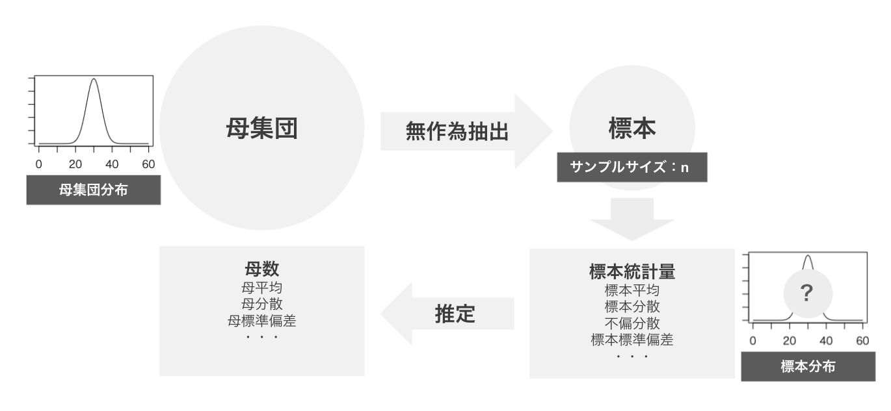
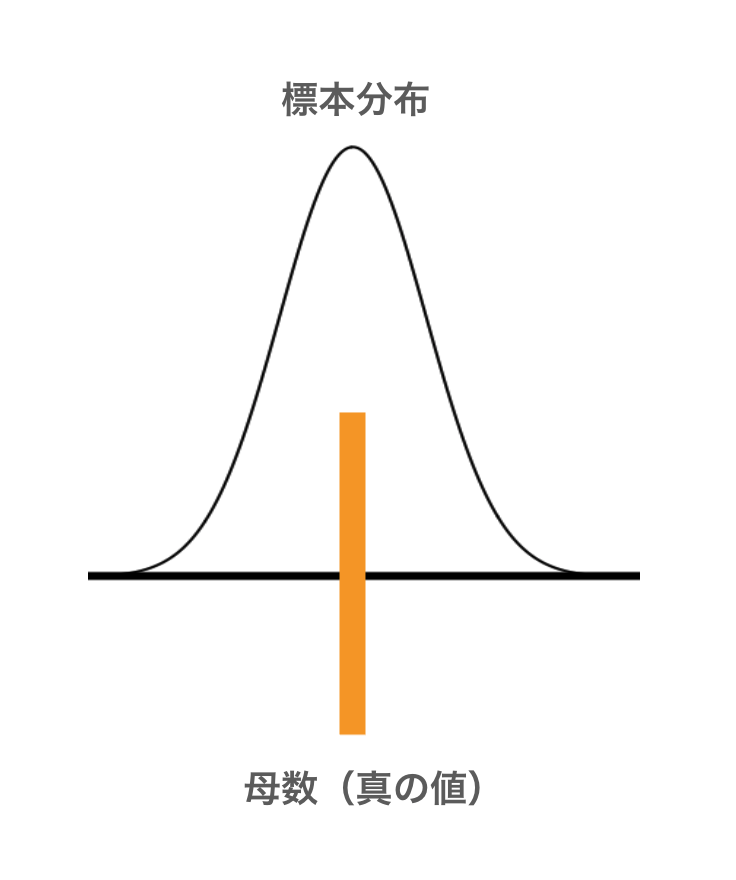
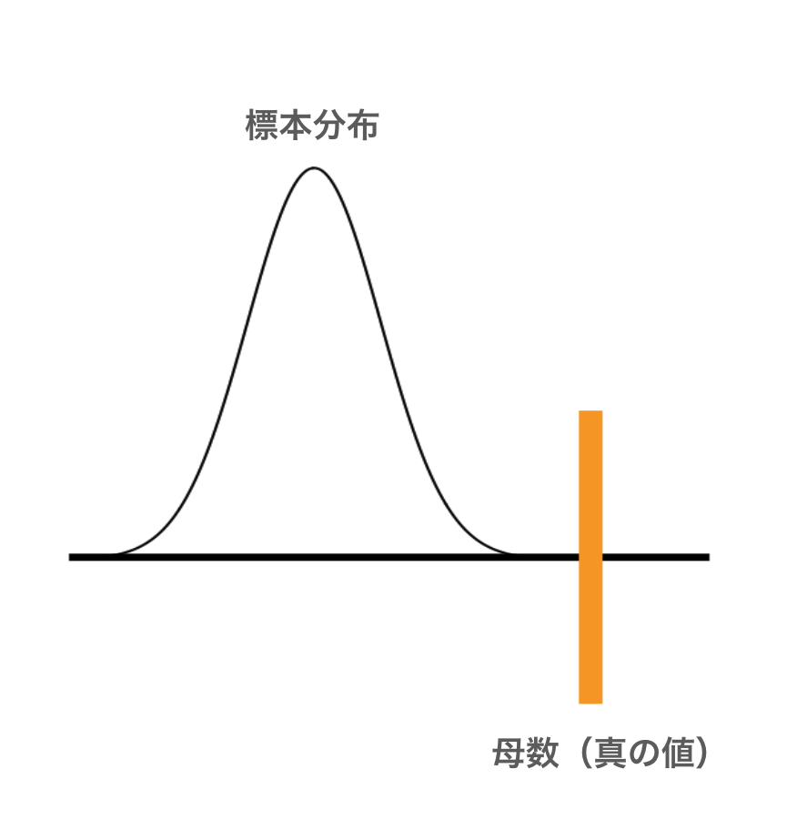
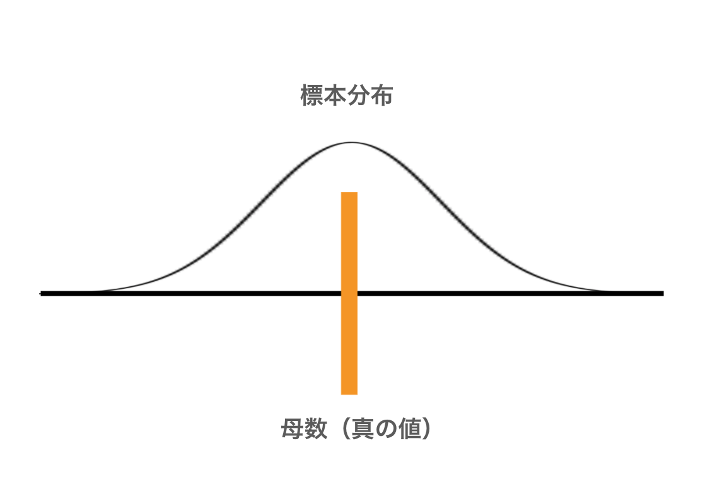

# 母集団分布と標本分布

* 母集団の持つ分布を母集団分布と呼ぶ
* 正規分布している母集団を正規母集団と呼ぶ
* 正規分布は平均と分散（標準偏差）の2つのパラメータによって分布の形状が決まる

> 以降の学習では「母集団は正規分布している」という前提のもとに連続型確率変数の区間推定や仮説検定について学習していきます。離散型変数や離散型分布については後の章で学習します。

---

## 標本分布

* 標本平均や不偏分散など、標本統計量の分布を標本平均と呼ぶ
* 確率変数である標本のデータから計算される標本統計量も確率変数である
* 標本分布は母数の推定に利用する

> 標本分布は**標本統計量**の確率分布です。**標本に含まれる個別データの分布ではありません。**

---

## 標本分布と母数の関係

* 標本統計量（推定量）の標本分布を使って母数を推定する
* 標本分布は母数を中心にばらつく必要がある（不偏性）
* 標本分布のばらつきが大きいと参考にならない（標準誤差）

> 上記の図に示す関係は母数を中心に、狭い範囲で標本分布のばらつきが確認できるため好ましい状態といえる

> 上記の図に示す関係はを標本分布が母数を捉えていないため推定に利用できない（不偏性が必要）

> 上記の図に示す関係はを標本分布が母数を捉えているがばらつきが大きいため推定の誤差が大きくなる（標準誤差を小さくする）

---

## 不偏性

* 推定量の期待値（標本分布の平均（中心））が母数の値と一致することを不偏性と呼ぶ
* 推定量の中で不偏性のあるものを不偏推定量と呼ぶ
* 標本平均は母平均の不偏推定量であり、不偏分散は母分散の不偏推定量である

> 標本統計量の中で推定に利用するものを推定量と呼びます。

---

## 標準誤差

* 推定量（標本分布）の標準偏差のこと
* 標準誤差が小さいほど母数推定時のばらつきが小さくなる
* 標本誤差はSE（Standard Error）と表現される

> 標準誤差の詳細については後述します。