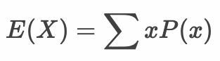

# 離散型確率変数

* 離散型確率変数とは確率変数の取りうる値が離散値（非連続値）となるもの
* 離散型確率変数はとりうる値と、その値の出現する確率を関数（確率分布関数）で表現できる
* コイン投げの結果やサイコロの出目などは離散型確率変数として考えることができる

---

## 離散型確率変数の確率分布

* 離散型確率変数の確率は関数で表現できる
* このような関数を確率分布関数や、単純に確率分布と呼ぶ


### 例：サイコロの出目を表す確率分布関数

```
P(X) = 1/6
```

あるいはXのとりうる範囲を具体的にして以下のように表現しても良い

```
P(X) = 1/6 : X ∈ {1, 2, 3, 4, 5, 6}
       0   : else
```

> A ∈ B とは要素Aは集合Bに属するという意味です。またここでは : を使って条件分けを記述しています。書籍では : を使わずに { を使って条件分けを記述することが多いです。サイコロでは1から6までの整数しかありえないので、それ以外の数値の出現する確率は0と記述しています。


### 例：2つのサイコロの出目の和を表す確率分布関数

```
P(X) = 1/36 * (X - 1)  : X ∈ {2, 3, 4, 5, 6, 7}
       1/36 * (13 - X) : X ∈ {8, 9, 10, 11, 12}
       0               : else
```

---


## 離散型確率変数の期待値

* 離散型確率変数Xの期待値 E(X) は以下のようになる



### 例：サイコロの出目の期待値

```
E(X) = ΣxP(x) = Σ(X * 1/6)
     = (1 * 1/6) + (2 * 1/6) + (3 * 1/6) + (4 * 1/6) + (5 * 1/6) + (6 * 1/6) 
     = 3.5
```

### 例：2つのサイコロの出目の和の期待値

```
E(X) = (2 * 1/36) + (3 * 2/36) + (4 * 3/36) + (5 * 4/36) + (6 * 5/36) + (7 * 6/36) + 
       (8 * 5/36) + (9 * 4/36) + (10 * 3/36) + (11 * 2/36) + (12 * 1/36)
     = 7
```

---

## 離散型確率変数の分散

* 離散型確率変数Xの分散 V(X) は以下のようになる


```
V(X) = Σ(X - E[X])^2P(X) = Σ(X - μ)^2P(X)
```

> 確率変数Xの期待値 E[X] を μ で表現しています。

* あるいは分散 V(X) は以下のように期待値で表現することもできる


---


## 離散型確率変数の確率分布

* 離散型確率変数の代表的な確率分布は以下のとおり
    * 離散一様分布
    * ベルヌーイ分布
    * 二項分布
    * ポアソン分布
    * 幾何分布

> これらの確率分布の詳細については後述します。

---

## エクササイズ

### 設問1

1枚のコインを投げて表の出る回数を確率変数Xとします。

1. 確率分布関数 P(X) を求めてください。

#### ヒント

```
P(X) = ? : X = 0
       ? : X = 1
```

2. 確率変数Xの期待値 E[X] を求めてください。
3. 確率変数Xの期待値 V[X] を求めてください。

---

### 設問2

2枚のコインを投げて表の出る回数を確率変数Xとします。

1. 確率分布関数 P(X) を求めてください。

#### ヒント

```
P(X) = ? : X = 0
       ? : X = 1
       ? : X = 1
```

2. 確率変数Xの期待値 E[X] を求めてください。
3. 確率変数Xの期待値 V[X] を求めてください。

---

### 設問3

2つのサイコロを投げて出目の大きい方を確率変数Xでとします。

1. 確率分布関数 P(X) を求めてください。
2. 確率変数Xの期待値 E[X] を求めてください。
3. 確率変数Xの期待値 V[X] を求めてください。
