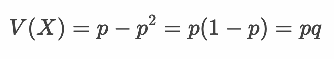

# ベルヌーイ分布

* コイン投げのように確率 p で 1（表）、確率 q =（1 - p） で 0（裏）をとる離散型確率分布
* 表か裏かのように2種類の結果しか得られない試行をベルヌーイ試行と呼ぶ
* ベルヌーイ分布は次に学習する二項分布のベースとなる確率分布


---

## ベルヌーイ分布にしたがう確率変数X

* ベルヌーイ分布のパラメータは 確率 p


> ベルヌーイ分布はBeなどと表現します。また 〜 は分布にしたがうという意味です。この場合、確率変数Xは確率 p のベルヌーイ分布にしたがうと読みます。

---

## 例：コイン投げ

* 1枚のコインを投げの結果を確率変数Xとする

```
X〜Be(0.5)
```

|X|0（裏）|1（表）|
|:--:|:--:|:--:|
|P(X)|1/2|1/2|


---

## 例：サイコロ

* サイコロの出目が1かどうかを確率変数Xとする

```
X〜Be(1/6)
```

|X|0（1以外が出る）|1（1が出る）|
|:--:|:--:|:--:|
|P(X)|5/6|1/6|


---


## ベルヌーイ分布の期待値

* ベルヌーイ分布の期待値は p となる


### 期待値の証明


---

## ベルヌーイ分布の分散

* ベルヌーイ分布の分散は pq となる


> V(X) = p(1 - p) と表現することもあります。

### 分散の証明




---

## エクササイズ

以下の確率変数Xのしたがう確率分布においてベルヌーイ分布に該当するものはどれか

1. X = サイコロの出目
1. X = サイコロの出目が6である
1. X = くじ引きをひいて当たりがでる
1. X = 10回くじ引きをひいて当たりが5回でる

<!-- 

解答
1. X = サイコロの出目が6である
1. X = くじ引きをひいて当たりがでる

-->