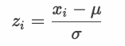

# R - データセット - women

```
> women
   height weight
1      58    115
2      59    117
3      60    120
4      61    123
5      62    126
6      63    129
7      64    132
8      65    135
9      66    139
10     67    142
11     68    146
12     69    150
13     70    154
14     71    159
15     72    164
```

> このデータセットは、30 ～ 39 歳のアメリカ人女性の平均身長と体重を示しています。

https://www.rdocumentation.org/packages/datasets/versions/3.6.2/topics/women

### w2_01.R

heightの平均値を表示してください。

```r
> ???
[1] 65
```

---

### w2_02.R

heightの分散を表示してください。ただし、Rの組み込み関数である `var` 関数、`sd` 関数は使わないのものとします。

```r
> ???
[1] 18.66667
```

---

### w2_03.R

heightの標準偏差を表示してください。ただし、Rの組み込み関数である `sd` 関数は使わないのものとします。

```r
> ???
[1] 4.320494
```

---

### w2_04.R

heightの分散（不偏分散）を表示してください。ただし、Rの組み込み関数である `var` 関数を使うものとします。

```r
> ???
[1] 20
```

> `w2_02.R` の結果と比べて値が大きくなります。

---

### w2_05.R

heightの標準偏差（不偏分散の標準偏差）を表示してください。ただし、Rの組み込み関数である `sd` 関数を使うものとします。

```r
> ???
[1] 4.472136
```

> `w2_03.R` の結果と比べて値が大きくなります。

---

### w2_06.R

heightの分散（標本分散）を表示してください。ただし、Rの組み込み関数である `var` 関数をの結果を加工して表示するものとします。

```r
> ???
[1] 18.66667
```

> `w2_02.R` の結果と比べて等しくなります。

---

### w2_07.R

heightの標準偏差（標本分散の標準偏差）を表示してください。ただし、Rの組み込み関数である `var` 関数をの結果を加工して表示するものとします。

```r
> ???
[1] 4.320494
```

> `w2_03.R` の結果と比べて等しくなります。

---

### w2_08.R

heightの値を標準化して表示してください。

```r
> ???
 [1] -1.6201852 -1.3887301 -1.1572751 -0.9258201 -0.6943651 -0.4629100 -0.2314550  0.0000000
 [9]  0.2314550  0.4629100  0.6943651  0.9258201  1.1572751  1.3887301  1.6201852
```

### 標準化の式



---

### w2_09.R

weightの値を標準化して表示してください。

```r
> ???
 [1] -1.4514860 -1.3179136 -1.1175551 -0.9171967 -0.7168382 -0.5164797 -0.3161212 -0.1157627
 [9]  0.1513820  0.3517405  0.6188851  0.8860298  1.1531744  1.4871053  1.8210361
```

---

### w2_10.R

* 標準化したheightの値の平均値と分散を調べてください。
* 標準化したweightの値の平均値と分散を調べてください。

<!-- 
women_df <- women
mean(women_df$height)

mean((women_df$height - mean(women_df$height)) ** 2)
sqrt(mean((women_df$height - mean(women_df$height)) ** 2))

var(women_df$height)
sd(women_df$height)

var(women_df$height) * (nrow(women_df) - 1) / nrow(women_df)
sqrt(var(women_df$height) * (nrow(women_df) - 1) / nrow(women_df))

height_z <- (women_df$height - mean(women_df$height)) / sqrt(mean((women_df$height - mean(women_df$height)) ** 2))
weight_z <- (women_df$weight - mean(women_df$weight)) / sqrt(mean((women_df$weight - mean(women_df$weight)) ** 2))
mean(height_z)
var(height_z) * (nrow(women_df) - 1) / nrow(women_df)
mean(weight_z)
var(weight_z) * (nrow(women_df) - 1) / nrow(women_df)

-->
