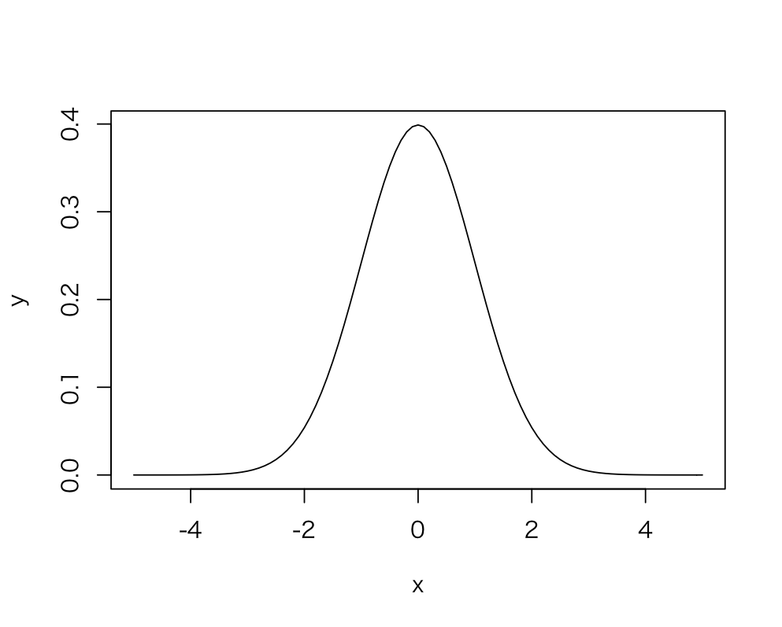
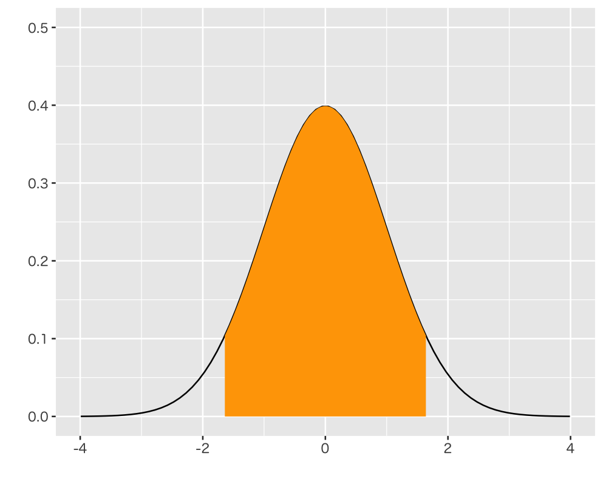
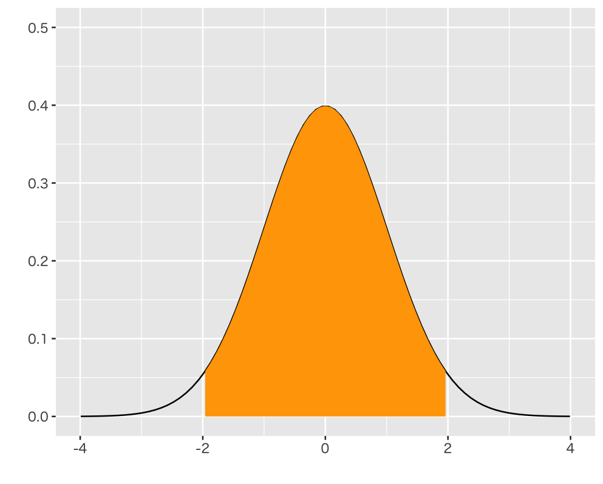

# 正規分布

## 問 1

平均：50、標準偏差：10の正規分布にしたがう乱数を10,000件生成して、ヒストグラムを表示してください。

---

## 問 2

標準正規分布にしたがう乱数を10,000件生成して、ヒストグラムを表示してください。

---

## 問 3

標準正規分布の確率密度関数を使って、以下のような確率密度グラフを表示してください。

---

## 問 4

標準正規分布の確率点 -1.64 〜 1.64 の範囲に全体の何％のデータが含まれるか調べてください。

---

## 問 5

標準正規分布の確率点 -1.96 〜 1.96 の範囲に全体の何％のデータが含まれるか調べてください。

---

## 問 6

標準正規分布の上側確率2.5%の確率点を調べてください。

---