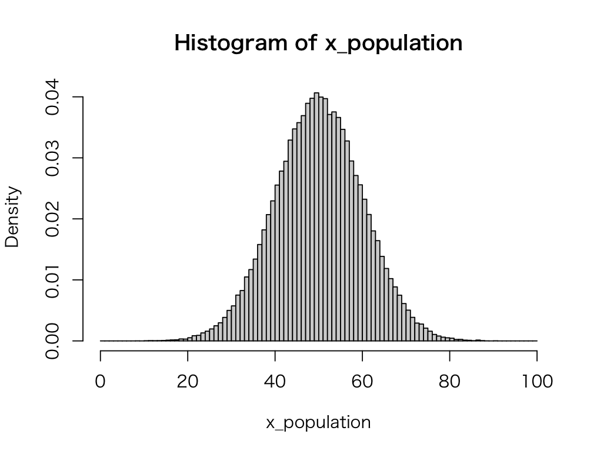
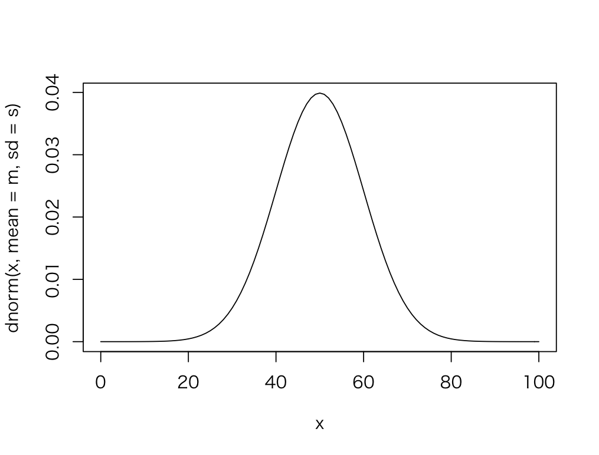
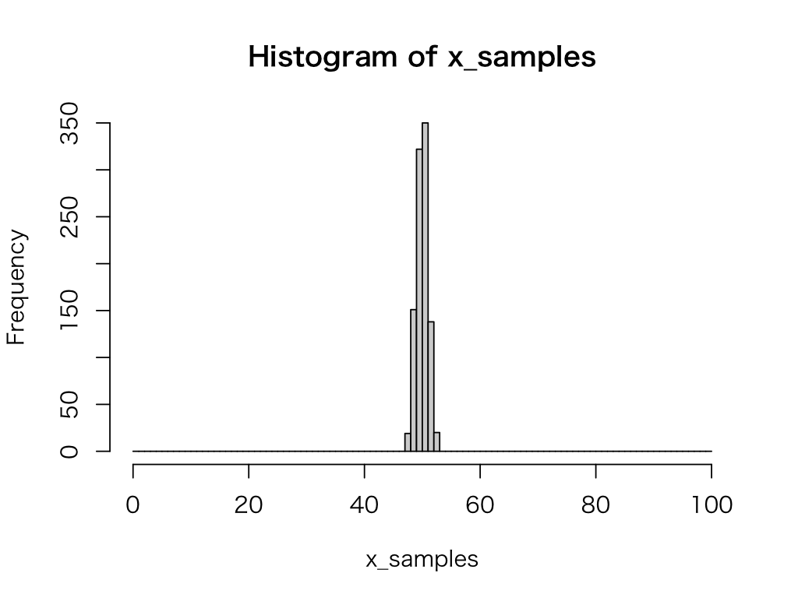
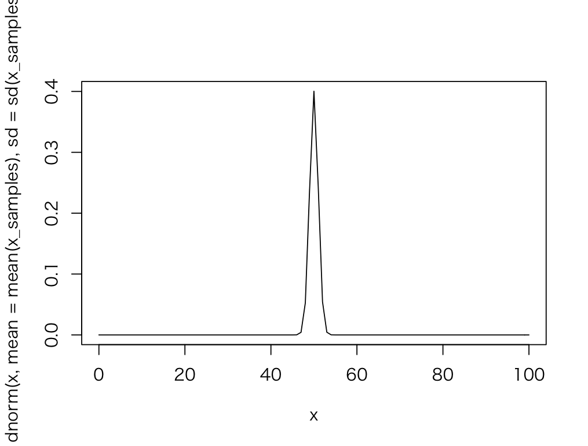
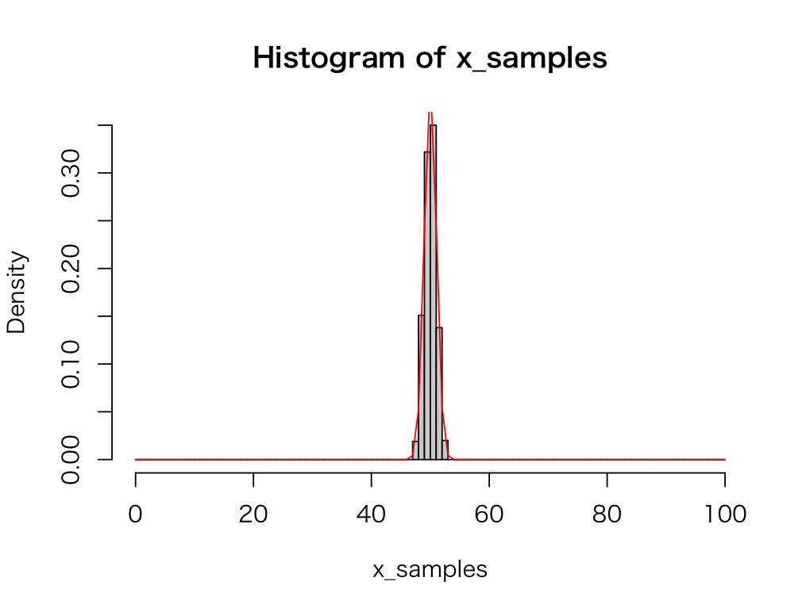

# 母集団分布と標本分布

## 問1

平均：50、標準偏差：10 の正規分布にしたがう乱数を100,000件生成して `x_population` という名前の変数に代入します。以下の要件にしたがって `x_population` 変数のヒストグラムを表示してください。

* ヒストグラムの縦軸（y軸）には度数（frequency）ではなく確率密度（density）を表示してください。
* ヒストグラムの階級は0〜100まで、また階級幅は1としてください。

> `hist` 関数の引数に `freq = FALSE` を追加するとY軸の値が確率密度（density）となります。また階級幅の指定には `hist` 関数の引数に `breaks = seq(0, 100, 1)` を追加します。



---

## 問2

正規分布の確率密度関数を使って、平均：50、標準偏差：10 の確率密度曲線を描画してください。



> 問1のヒストグラムと問2の確率密度関数の曲線が近似することを確認してください。

---

## 問3

`x_population` 変数を母集団データとして、標本抽出のシミュレーションを行います。サンプルサイズ100の標本から標本平均を求める作業を1000回繰り返して、1000セットの標本平均（`x_samples` 変数）を作成します。得られた標本平均の一覧からヒストグラムを表示してください。



---

## 問4

`x_samples` 変数の平均値と標準偏差を表示してください。


> 母集団となる `x_population` 変数の平均：50、標準偏差：10 と比べて、標本平均の標本分布である`x_samples` 変数の平均や標準偏差がどのように変化するか確認してください。

---

## 問5 

正規分布の確率密度関数を使って、問4で求めた `x_samples` 変数の平均値と標準偏差から、確率密度曲線を描画してください



---

## 問6

問3のヒストグラムに問5の確率密度曲線を重ねて表示してください。



> `hist` 関数の結果に曲線を追記するときは `curve` 関数を使います。

#### ヒント

```r
hist(rnorm(100), freq = F)
curve(dnorm(x), add = TRUE)
```

---


<!--

```r
# 1
m <- 50
s <- 10 
x_population <- rnorm(100000, mean = m, sd = s)
hist(x_population, freq = F, breaks = seq(0, 100, 1))

# 2
x <- seq(0, 100, 1)
plot(x, dnorm(x, mean = m, sd = s), type = "l")


# 3
x_samples <- numeric(1000)
x_sample_size <- 100
for (i in 1:length(x_samples)) {
  x_samples[i] <- mean(sample(x_population, x_sample_size))
}
hist(x_samples, breaks = seq(0, 100, 1))

# 4
mean(x_samples)
sd(x_samples)

# 5
x <- seq(0, 100, 1)
plot(x, dnorm(x, mean = mean(x_samples), sd = sd(x_samples)), type = "l")

# 6
hist(x_samples, freq = F, breaks = seq(0, 100, 1))
curve(dnorm(x, mean = mean(x_samples), sd = sd(x_samples)), add = T, col = "red")


hist(rnorm(100), freq = F)
curve(dnorm(x), add = TRUE)
```

-->