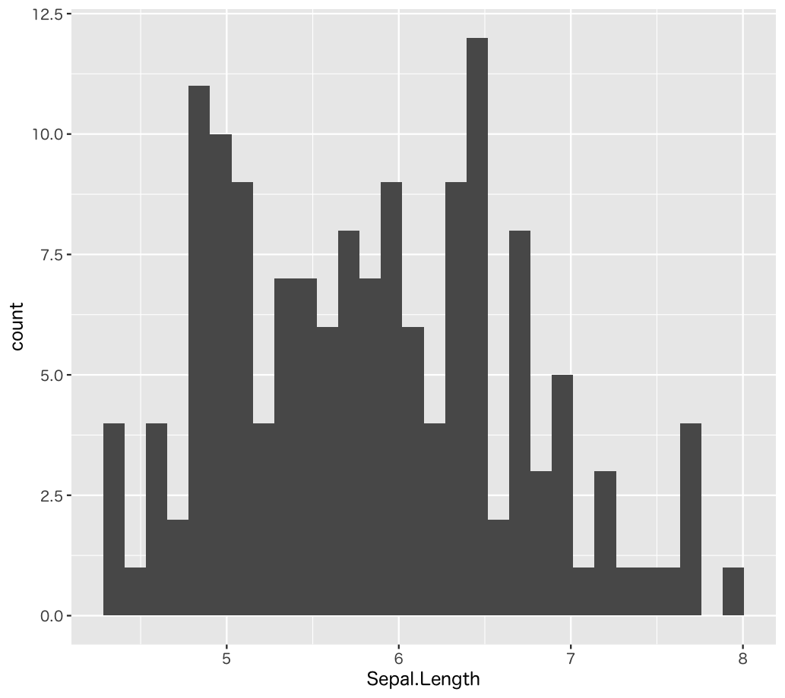
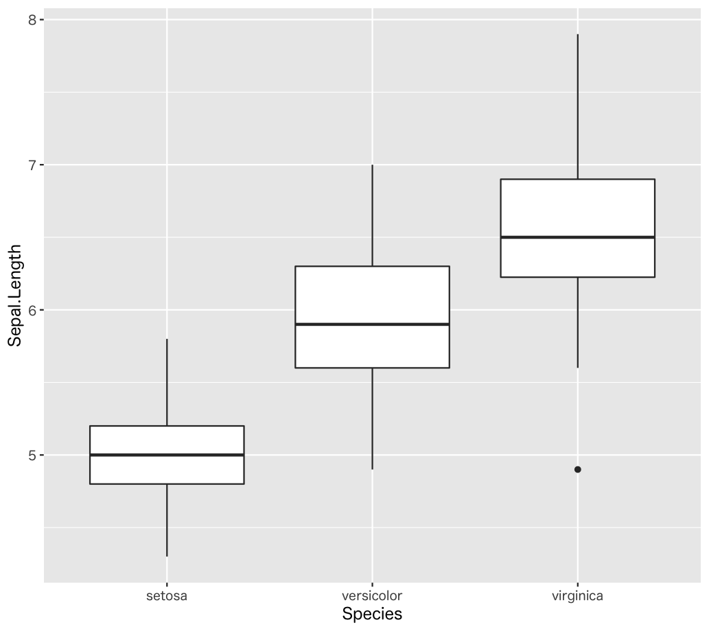
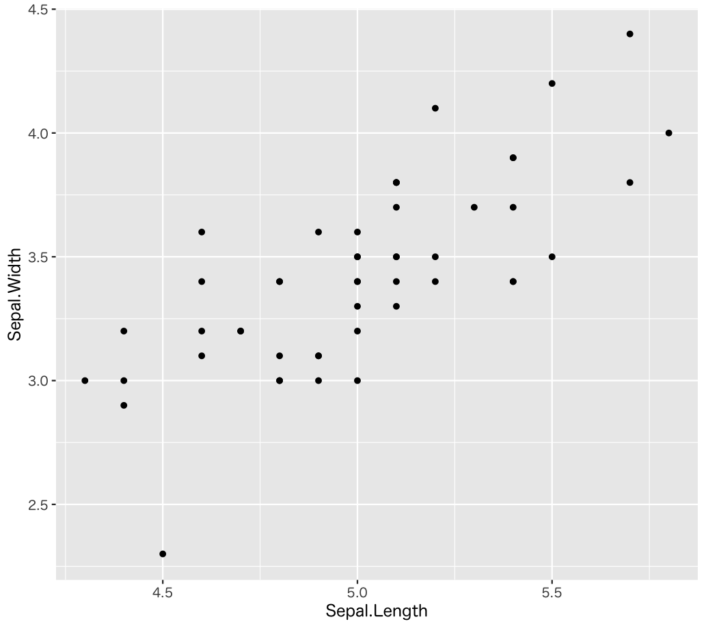
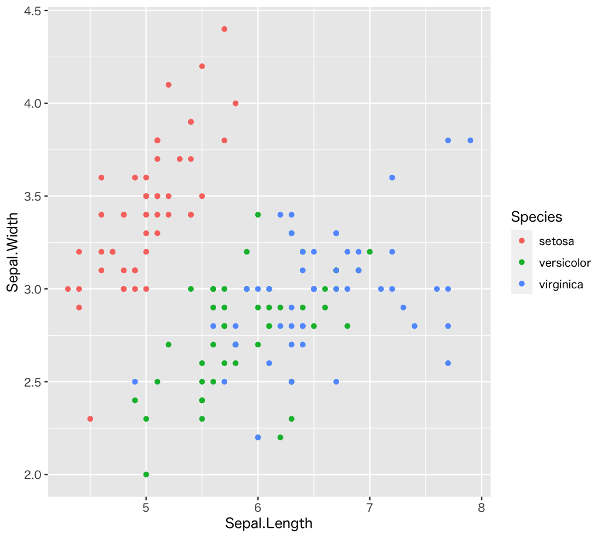

# Tidyverse - Training

## No. 1

irisデータセットについて、以下の指定に従ってレコードを表示してください。

*  `Sepal.Length` が 7.5 以上

### 実行結果

```r
# A tibble: 6 x 5
  Sepal.Length Sepal.Width Petal.Length Petal.Width Species  
         <dbl>       <dbl>        <dbl>       <dbl> <fct>    
1          7.6         3            6.6         2.1 virginica
2          7.7         3.8          6.7         2.2 virginica
3          7.7         2.6          6.9         2.3 virginica
4          7.7         2.8          6.7         2   virginica
5          7.9         3.8          6.4         2   virginica
6          7.7         3            6.1         2.3 virginica
```

---

## No. 2

irisデータセットについて、以下の指定に従ってレコードを表示してください。

* `Sepal.Length` が 5 以下、かつ `Species` が `versicolor`

### 実行結果

```r
# A tibble: 3 x 5
  Sepal.Length Sepal.Width Petal.Length Petal.Width Species   
         <dbl>       <dbl>        <dbl>       <dbl> <fct>     
1          4.9         2.4          3.3           1 versicolor
2          5           2            3.5           1 versicolor
3          5           2.3          3.3           1 versicolor
```

---

## No. 3

irisデータセットについて、以下の指定に従ってレコードを表示してください。

* `Sepal.Length` が 7.5 以上
* 行（レコード）の並び順は `Sepal.Length`の降順、`Sepal.Width` の降順

### 実行結果

```r
# A tibble: 6 x 5
  Sepal.Length Sepal.Width Petal.Length Petal.Width Species  
         <dbl>       <dbl>        <dbl>       <dbl> <fct>    
1          7.9         3.8          6.4         2   virginica
2          7.7         3.8          6.7         2.2 virginica
3          7.7         3            6.1         2.3 virginica
4          7.7         2.8          6.7         2   virginica
5          7.7         2.6          6.9         2.3 virginica
6          7.6         3            6.6         2.1 virginica
```

---

## No. 4

irisデータセットについて、以下の指定に従ってレコードを表示してください。

* `Sepal.Length` が 7.5 以上
* 行（レコード）の並び順は `Sepal.Length`の降順、`Sepal.Width` の降順
* 列の並び順は `Species`, `Sepal.Length`, `Sepal.Width`, `Petal.Length`, `Petal.Width`

### 実行結果

```r
# A tibble: 6 x 5
  Species   Sepal.Length Sepal.Width Petal.Length Petal.Width
  <fct>            <dbl>       <dbl>        <dbl>       <dbl>
1 virginica          7.9         3.8          6.4         2  
2 virginica          7.7         3.8          6.7         2.2
3 virginica          7.7         3            6.1         2.3
4 virginica          7.7         2.8          6.7         2  
5 virginica          7.7         2.6          6.9         2.3
6 virginica          7.6         3            6.6         2.1
```

---

## No. 5

irisデータセットについて、以下の指定に従ってレコードを表示してください。

* `Sepal.Length` が 7.5 以上
* 行（レコード）の並び順は `Sepal.Length`の降順、`Sepal.Width` の降順
* 列の並び順は `Species`, `Sepal.Length`, `Sepal.Width`, `Petal.Length`, `Petal.Width`
* `Sepal.Diff`、`Petal.Diff` 列を追加する
    * `Sepal.Diff` 列には `Sepal.Length` 列と `Sepal.Width` 列の差を表示する
    * `Petal.Diff` 列には `Petal.Length` 列と `Petal.Width` 列の差を表示する

### 実行結果

```r
# A tibble: 6 x 7
  Species   Sepal.Length Sepal.Width Petal.Length Petal.Width Sepal.diff Petal.diff
  <fct>            <dbl>       <dbl>        <dbl>       <dbl>      <dbl>      <dbl>
1 virginica          7.9         3.8          6.4         2          4.1        4.4
2 virginica          7.7         3.8          6.7         2.2        3.9        4.5
3 virginica          7.7         3            6.1         2.3        4.7        3.8
4 virginica          7.7         2.8          6.7         2          4.9        4.7
5 virginica          7.7         2.6          6.9         2.3        5.1        4.6
6 virginica          7.6         3            6.6         2.1        4.6        4.5
```

---

## No. 6

irisデータセットについて、以下の指定に従ってレコードを表示してください。

* `Sepal.Length`, `Sepal.Width`, `Petal.Length`, `Petal.Width`列の平均値を表示する 

### 実行結果

```r
# A tibble: 1 x 4
  S.L.mean S.W.mean P.L.mean P.W.mean
     <dbl>    <dbl>    <dbl>    <dbl>
1     5.84     3.06     3.76     1.205
```

---

## No. 7

irisデータセットについて、以下の指定に従ってレコードを表示してください。

* `Species` 列でグループ化する
* `Sepal.Length`, `Sepal.Width`, `Petal.Length`, `Petal.Width`列の平均値を表示する 

### 実行結果

```r
# A tibble: 3 x 5
  Species    S.L.mean S.W.mean P.L.mean P.W.mean
  <fct>         <dbl>    <dbl>    <dbl>    <dbl>
1 setosa         5.01     3.43     1.46    0.246
2 versicolor     5.94     2.77     4.26    1.33 
3 virginica      6.59     2.97     5.55    2.03 
```

---

## No. 8

irisデータセットについて、以下の指定に従ってグラフを表示してください。

* `Sepal.Length` のヒストグラムを表示する

### 実行結果



---

## No. 9

irisデータセットについて、以下の指定に従ってグラフを表示してください。

* `Species` 単位で　`Sepal.Length` の箱ひげ図を表示する

### 実行結果



---

## No. 10

irisデータセットについて、以下の指定に従ってグラフを表示してください。

* `Species` が `setosa` のレコードを抽出する
* `Sepal.Length`, `Sepal.Width` の散布図を表示する

### 実行結果



---

## No. 11

irisデータセットについて、以下の指定に従ってグラフを表示してください。

* `Sepal.Length`, `Sepal.Width` の散布図を表示する
* `Species` 単位でカラーを分ける

### 実行結果



---

## No. 12

irisデータセットの `Species` が `setosa` のレコードの `Sepal.Length` 列について母平均の95%信頼区間を求めてください。

---

## No. 13

irisデータセットの`Species` が `setosa` のレコードの `Sepal.Length` 列について仮説検定を行います。

* H0: `Species` が `setosa` の レコードの `Sepal.Length` は 5.0 と差がない
* H1: `Species` が `setosa` の レコードの `Sepal.Length` は 5.0 と差がある
* 有意水準： 5% 両側検定

仮説検定の結果をまとめてください。


<!-- 
# 1
iris %>% as_tibble() %>% 
  filter(Sepal.Length >= 7.5)
  
# 2
iris %>% as_tibble() %>% 
  filter(Sepal.Length <= 5, Species == "versicolor")

# 3
iris %>% as_tibble() %>% 
  filter(Sepal.Length >= 7.5) %>% 
  arrange(desc(Sepal.Length), desc(Sepal.Width))

# 4
iris %>% as_tibble() %>% 
  filter(Sepal.Length >= 7.5) %>% 
  arrange(desc(Sepal.Length), desc(Sepal.Width)) %>% 
  select(Species, everything())

# 5
iris %>% as_tibble() %>% 
  filter(Sepal.Length >= 7.5) %>% 
  arrange(desc(Sepal.Length), desc(Sepal.Width)) %>% 
  select(Species, everything()) %>% 
  mutate(
    Sepal.Diff = Sepal.Length - Sepal.Width,
    Petal.Diff = Petal.Length - Petal.Width
  )  

# 6
iris %>% as_tibble() %>% 
  summarise(
    S.L.mean = mean(Sepal.Length),
    S.W.mean = mean(Sepal.Width),
    P.L.mean = mean(Petal.Length),
    P.W.mean = mean(Petal.Width),
  )

# 7
iris %>% as_tibble() %>% 
  group_by(Species) %>% 
  summarise(
    S.L.mean = mean(Sepal.Length),
    S.W.mean = mean(Sepal.Width),
    P.L.mean = mean(Petal.Length),
    P.W.mean = mean(Petal.Width),
  )

# 8
iris %>% as_tibble() %>% 
  ggplot(aes(Sepal.Length)) +
  geom_histogram(bins = 30)

# 9  
iris %>% as_tibble() %>% 
  ggplot(aes(Sepal.Length, Species)) +
  geom_boxplot() +
  coord_flip()

# 10
iris %>% as_tibble() %>% filter(Species == "setosa") %>% 
  ggplot(aes(Sepal.Length, Sepal.Width)) + 
  geom_point()

# 11
iris %>% as_tibble() %>% 
  ggplot(aes(Sepal.Length, Sepal.Width, col = Species)) + 
  geom_point()

# 12, 13
iris %>% as_tibble() %>% filter(Species == "setosa") %>% pull(Sepal.Length) -> setosa.Sepal.Length
t.test(setosa.Sepal.Length, mu = 5.0)

# 12
lq <- qt(0.025, df = setosa.Sepal.Length.size - 1)
uq <- qt(0.975, df = setosa.Sepal.Length.size - 1)
ci_min <- setosa.Sepal.Length.mean + (lq * setosa.Sepal.Length.sd / sqrt(setosa.Sepal.Length.size))
ci_max <- setosa.Sepal.Length.mean + (uq * setosa.Sepal.Length.sd / sqrt(setosa.Sepal.Length.size))
paste(ci_min, "-", ci_max)

# 13
t <- (setosa.Sepal.Length.mean - 5) / (setosa.Sepal.Length.sd / sqrt(setosa.Sepal.Length.size))
p <- pt(t, df = setosa.Sepal.Length.size - 1, lower.tail = t < 0) * 2
t
p

-->