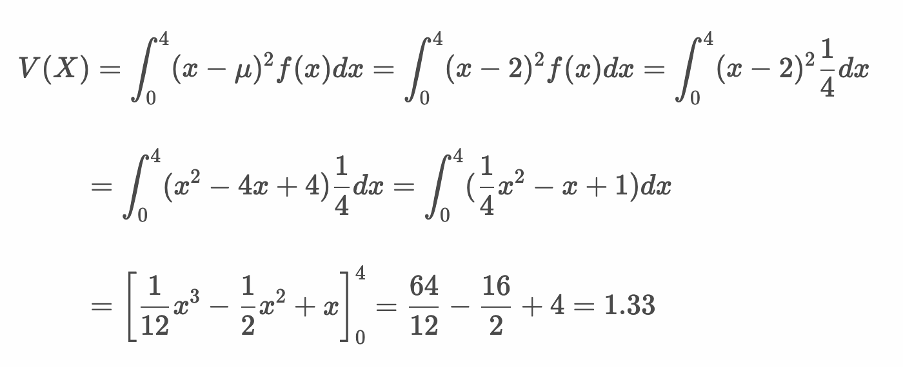

# 確認テスト

### No. 1

「ABCD」の4文字を並び替えるとき、全部で何通りの並び方が存在するか調べてください。

---

### No. 2

「ABCD」の4文字から2文字を選んで並び替えるとき、全部で何通りの並び方が存在するか調べてください。

---

### No. 3

「ABCD」の4文字から2文字を選ぶとき、全部で何通り取り出し方が存在するか調べてください。ただし、文字の並び順は考慮しないものとします。

---

### 問題

「2枚のコイン投げ」という試行において表をT、裏をFとしたとき、標本空間を以下のように定義しました。

```
Ω = {(T, T), (T, F), (F, T), (F, F)}
```

このとき、少なくとも1回は表が出る事象Aを以下のように定義します。

```
A = {(T, T), (T, F), (F, T)}
```

以下の設問に答えてください。

#### No. 4

少なくとも1回は裏が出る事象Bを求めてください。

---

#### No. 5

表が2回でる事象Cを求めてください。

---

#### No. 6


事象A、B、Cの中から2つを選んだとき、排反事象となる組み合わせはどれか。

---

#### No. 7

事象Aの補事象を求めてください。

---

### 問題

ジョーカーを除く52枚のトランプから1枚のカードを引いたときの事象A、Bを以下のとおり定義します。

* A: カードの数値が3以下である
* B: カードの種類がハートである

#### No. 8

以下の確率を求めてください。

```
P(A)
```

---

#### No. 9

以下の確率を求めてください。

```
P(B)
```

---

#### No. 10

以下の確率を求めてください。

```
P(A∪B)
```

---

### No. 11

2つのサイコロを振った結果、出た目の合計が4以下になる確率を求めたい。このとき1つ目のサイコロの出た目が2であった場合の条件付き確率を求めてください。

---

### 問題

* 迷惑メールをフィルタリングするアルゴリズムを考えている
* 過去のデータから通常のメールと迷惑メールの割合は 9:1 だということがわかっている
* 通常のメールと迷惑メールに、URLが含まれる割合を調査すると以下のようになった

|<br>|URLを含む|URLを含まない|
|:--|:--:|:--:|
|通常のメール|30%|70%|
|迷惑メール|90%|10%|

* また以下のように事象A、事象Bを定義する
  * 事象A：URLを含んでいる
  * 事象B：迷惑メールである

#### No . 12

P(A)を求めてください。

---

#### No . 13

P(B)を求めてください。

---

#### No . 14

P(A|B)を求めてください。

---

#### No . 15

あるメールがURLを含んでいる場合、そのメールが迷惑メールである確率を求めてください。

---

### 問題

以下の確率分布に従うサイコロがあります。

|出目|1|2|3|4|5|6|
|:--:|:--:|:--:|:--:|:--:|:--:|:--:|
|確率|1/2|1/10|1/10|1/10|1/10|1/10|

#### No. 16

期待値 `E(X)` を求めてください。

---

#### No. 17

分散 `V(X)` を求めてください。

---

### No. 18

4枚のコインを投げて表が出る枚数ごとの確率を求めてください。

|X|0枚|1枚|2枚|3枚|4枚|
|:--:|:--:|:--:|:--:|:--:|:--:|
|P(X)|?|?|?|?|?|

---

### No. 19

10枚のコインを投げて表が出る枚数が9枚以下となる確率を求めてください。

---

### 問題

次の確率密度関数があります。


#### No.20

この確率密度関数にしたがう連続型確率変数 `X` の値が0〜2の範囲をとる確率を求めてください。

---

#### No.21

この確率密度関数にしたがう連続型確率変数 `X` の期待値を求めてください。

---

#### No.22

この確率密度関数にしたがう連続型確率変数 `X` の分散を求めてください。


---

<!-- 

### No. 1

1. 「ABCD」の4文字を並び替えるとき、全部で何通りの並び方が存在するか調べてください。

factorial(4)
24とおり

### No. 2

1. 「ABCD」の4文字から2文字を選んで並び替えるとき、全部で何通りの並び方が存在するか調べてください。

n <- 4
k <- 2
factorial(n) / factorial(n - k)
12とおり

### No. 3

1. 「ABCD」の4文字から2文字を選ぶとき、全部で何通り取り出し方が存在するか調べてください。ただし、文字の並び順は考慮しないものとします。

n <- 4
k <- 2
choose(n, k)
6とおり

### No. 4

* 少なくとも1回は裏が出る事象Bを求めてください。

```
B = {(T, F), (F, T), (F, F)}
```

### No. 5

* 表が2回でる事象Cを求めてください。

```
C = {(T, T)}
```

### No. 6

* 事象A、B、Cの中から2つを選んだとき、排反事象となる組み合わせはどれか。

BとC

### No. 7


* 事象Aの補事象を求めてください。

```
A = {(F, F)}
```

### No. 8

* P(A)
    12/52

### No. 9

* P(B)
    13/52

### No. 10

* P(A∪B)
   12/52 + 13/52 - 3/52 = 22/52

### No. 11

1つ目のサイコロの出た目が2（事象Bとする）
(2, 1) (2, 2) (2, 3) (2, 4) (2, 5) (2, 6)
P(B) = 6/36 = 1/6

事象Aと事象Bの積事象（A∩B）
(2, 1) (2, 2)
P(A∩B) = 2/36

事象Bを条件とする事象Aの条件付き確率
P(A|B) = P(A∩B) / P(B) = (2/36) / (1/6) = 12/36 = 1/3

### No. 12

P(A) = 0.9 * 0.3 + 0.1 * 0.9 = 0.36

### No. 13

P(B) = 0.1

### No. 14

P(A|B) = 0.9

### No. 15

P(B|A) = P(B)P(A|B) / P(A) = 0.1 * 0.9 / 0.36 = 0.25

### No. 16

* 期待値 `E(X)` を求めてください。

E(X) = 1 * 1/2 + 2 * 1/10 + 3 * 1/10 + 4 * 1/10 + 5 * 1/10 + 6 * 1/10 = 2.5

### No. 17

* 分散 `V(X)` を求めてください。

E(X^2) = 1^2 * 1/2 + 2^2 * 1/10 + 3^2 * 1/10 + 4^2 * 1/10 + 5^2 * 1/10 + 6^2 * 1/10 = 9.5
E(X)^2 = 2.5^2 = 6.25

V(X) = E(X^2) - E(X)^2 = 9.5 - 6.25 = 3.25

### No. 18

> x <- dbinom(0:4, 4, 1/6)
> x
[1] 0.4822530864 0.3858024691 0.1157407407 0.0154320988 0.0007716049
> barplot(x, names.arg = 0:4)

### No. 19

> pbinom(9, 10, 0.5)
[1] 0.9990234
> 1 - dbinom(10, 10, 1/2)
[1] 0.9990234

### No. 20

* xが0〜2の範囲をとる確率: 1/2 = 0.50%

### No. 21


### No. 22




-->